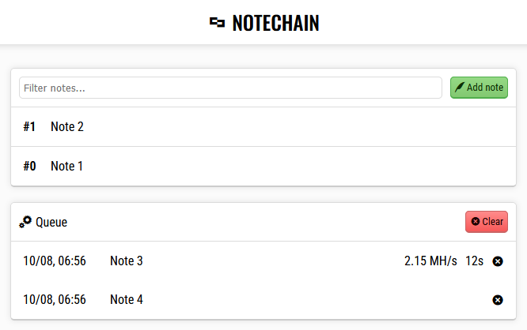
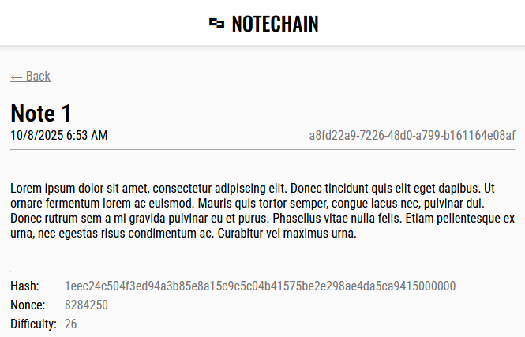

*README на русском языке: [[README.ru.md](README.ru.md)]

# Notechain
> **Notechain**: a blockchain-based diary using a proof-of-work system.

This repository contains a simple core for working with a chain of records, along with a web interface for convenient chain management.

> [!WARNING]
> This project is a personal practice experiment in building relatively complex systems.
> It contains several serious issues and should not be used for real data storage.

<div align="center">
  
  
</div>

## Concept
Notechain is an experimental platform for storing data as an immutable chain of records.
The main idea is to ensure data immutability without encryption or external services,
relying instead on the computational cost of modifying the chain.

The system achieves this by implementing a proof-of-work (PoW) mechanism.
To add a new block (record) to the chain, a computationally expensive operation must be performed —
finding a hash that meets specific conditions — the hash must contain a certain number of consecutive zero bits.

Verifying an existing block, on the other hand, requires very little computational effort —
anyone can confirm its validity without redoing the entire calculation.

The core of block generation lies in finding a Nonce value (a one-time number) such that
the result of computing the block’s SHA-256 hash meets the defined difficulty target.
The algorithm iterates through possible Nonce values until a valid one is found.

### Block Hash Generation
To generate a block hash, the byte representations of the following fields are concatenated:
```
sha256
(
  [Id]
  [Height]
  [Previous hash]
  [Timestamp]
  [Nonce]
  [Difficulty]
  [Comment]
  [Data]
)
```

## Blockchain Serialization
To store the blockchain as a file, custom rules for serialization and deserialization were defined.
The blockchain is serialized into a compact binary format, described below.

### Chain Header Structure
|  Type  |  Length |    Description   |
|--------|---------|------------------|
|  Int32 | 4 bytes | Number of blocks |
| UInt32 | 4 bytes | Title size       |
| Byte[] |       - | Title            |

The total header size is **256 bytes**.
If the actual data length is smaller than the header size, the remaining bytes are padded with zeros.

### Block Structure
|   Type   |  Length  |     Description     |
|----------|----------|---------------------|
| Guid     | 16 bytes | Unique ID           |
| UInt32   |  4 bytes | Height              |
| Byte[]   | 32 bytes | Block hash          |
| Byte[]   | 32 bytes | Previous block hash |
| DateTime |  8 bytes | Timestamp           |
| Int64    |  8 bytes | Nonce value         |
| Int32    |  4 bytes | Difficulty          |
| UInt32   |  4 bytes | Comment size        |
| Byte[]   |     -    | Comment             |
| UInt64   |  8 bytes | Data size           |
| Byte[]   |     -    | Data                |
