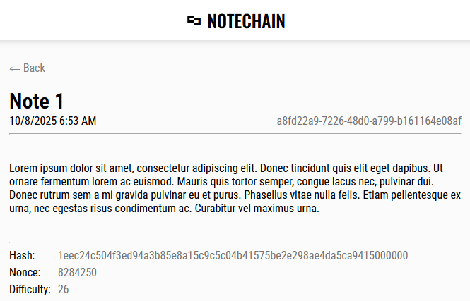

*English version of README*: [[README.md](README.md)]

# Notechain
> **Notechain**: блокчейн-дневник с системой proof-of-work.

Этот репозиторий содержит простое ядро для работы с цепочкой записей, а также веб-интерфейс для удобного управления цепью.

> [!WARNING]
> Этот проект - моя практика в области создания относительно сложных проектов.
> Он содержит несколько серьезных проблем, не стоит использовать его для реального хранения заметок.

<div align="center">
  
  
</div>

## Концепция
Notechain — это экспериментальная платформа для хранения данных в виде неизменяемой цепочки записей.
Основная идея заключается в том, чтобы обеспечить неизменность истории без использования шифрования
или сторонних сервисов, опираясь на вычислительную сложность внесения изменений.

Система достигает этого за счёт применения механизма proof-of-work.
Для добавления нового блока (записи) в цепочку требуется произвести вычислительно затратную операцию —
найти хэш, удовлетворяющий заданным условиям — хеш должен содержать определенное количество нулевых битов подряд.

Проверка валидности уже существующего блока, напротив, занимает крайне мало ресурсов —
любой может убедиться в его корректности, не выполняя заново всю работу.

Ключевая идея генерации блока состоит в поиске значения Nonce (одноразового кода), при котором
результат вычисления SHA-256 хэша блока соответствует установленному критерию сложности.
Алгоритм перебирает возможные значения Nonce до тех пор, пока не будет найдено подходящее.

### Создание хеша блока
Для генерации хеша блока конкатенируются байтовые представления следующих полей:
```
sha256
(
  [Id]
  [Height]
  [Previous hash]
  [Timestamp]
  [Nonce]
  [Difficulty]
  [Comment]
  [Data]
)
```

## Сериализация цепочки блоков
Для хранения цепочки блоков в виде файла были определены правила ее сериализации и
десериализации. Цепочка блоков сериализуется в наиболее сжатый бинарный формат, который определен далее.

### Структура заголовка цепочки
|  Тип   |  Размер |         Описание         |
|--------|---------|--------------------------|
|  Int32 | 4 байта | Кол-во блоков            |
| UInt32 | 4 байта | Размер названия в байтах |
| Byte[] |       - | Название (UTF-8)         |

Размер заголовка составляет **256 байт**. Если фактическая длина полезных данных меньше, чем размер заголовка,
то заголовок добивается нулями до нужного размера.

### Структура блока
|   Тип    |  Размер  |     Описание                |
|----------|----------|---------------------------- |
| Guid     |  16 байт | Уникальный идентификатор    |
| UInt32   |  4 байта | Высота (порядковый номер)   |
| Byte[]   | 32 байта | Хеш блока                   |
| Byte[]   | 32 байта | Хеш предыдущего блока       |
| DateTime |   8 байт | Временная метка             |
| Int64    |   8 байт | Nonce (одноразовый код)     |
| Int32    |  4 байта | Сложность                   |
| UInt32   |  4 байта | Размер комментария в байтах |
| Byte[]   |        - | Комментарий (UTF-8)         |
| UInt64   |   8 байт | Размер данных в байтах      |
| Byte[]   |        - | Данные                      |